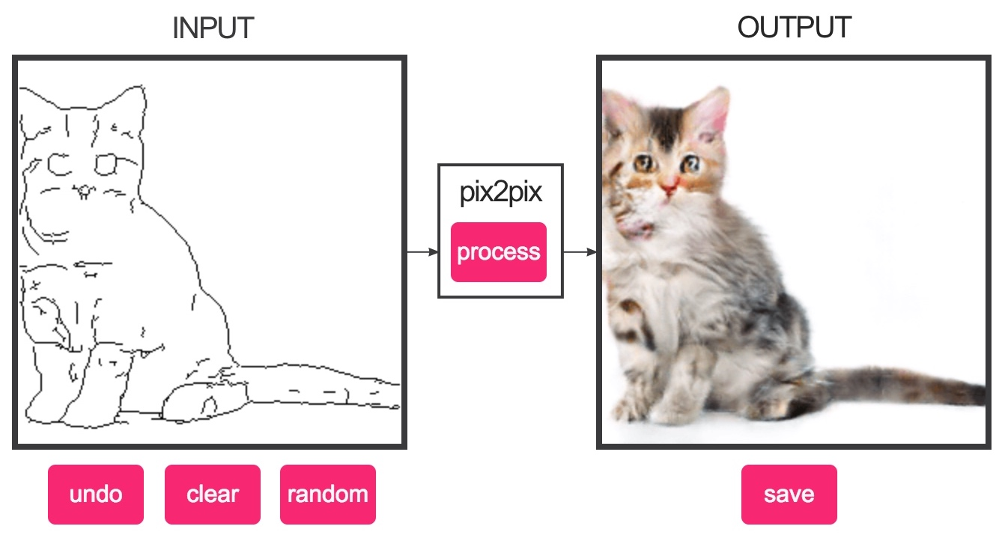

# Quick-n-easy-pix2pix-Keras-implementation
This is an old project, implementing the pix2pix DL model in Keras.

Real quick and easy use:
Simply run <b>python pix2pix.py</b> in the command line in the directory.

You can edit the code to change the name of the weights file, or input / target folders, or leave things as they are.

The model will start training by using the image files in <b>test_data/input</b> as the input and the ones in <b>test_data/target</b> as the target images.
You'll need to add your own pictures into those folders.

The folder test_data comes with an image prep script which transforms pictures into a version of just their lines (using canny edge detector), if you want to recreate the same kind of effect of the original pix2pix web version.

Otherwise, you can simply put your own pictures, it doesn't matter what's in them, so long as they have some form of structural match with one another.

<b>The Pictures in the input folder and the target folder have to have the same names - they are matched with one another by their names.</b>

There is a third folder - <b>text_data/test_images</b>
This is the folder for your test dataset. The pictures you want to predict the model on, to see how well it works.
These will be plotted at the end of the training run.

## Settings
To change the number of epochs to train the model, or the batch size (the model uses Adam as an optimizer, which might be a bit heavy if coupled with large batches for some machines), open the pix2pix.py file and scroll to the section called:
## VARIABLES TO CHANGE ##

There you can change the number_epochs and the batch_size variables.

Image size is 256x256 pixels, 3 color channels (RGB).
